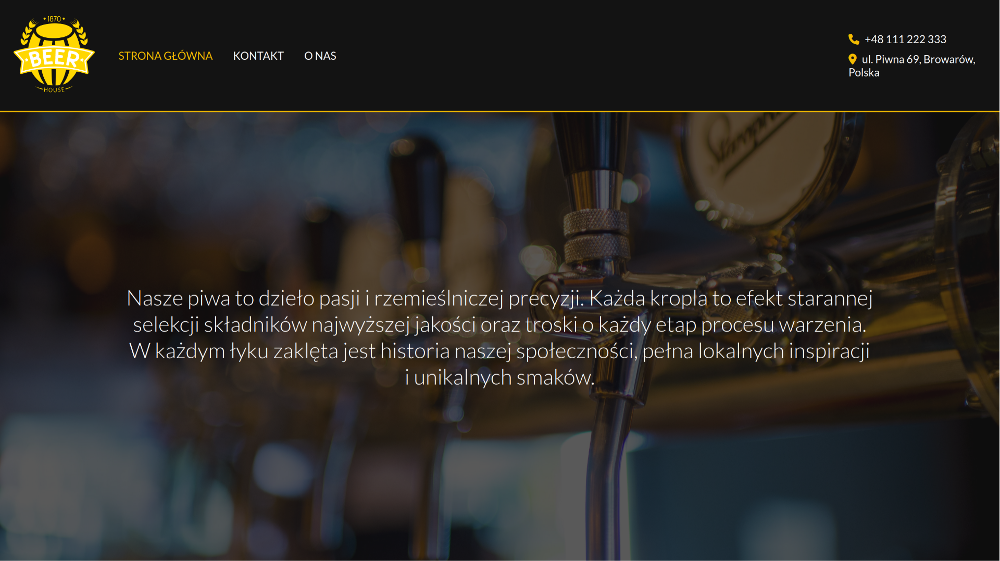

# BeerHouse - static website using plain HTML/CSS and JS

## Purpose of the project
The main purpose of the project is to use HTML/CSS/JS in practice to create static, polished and responsive website for my webdev course.

## Features
- responsive image carousel with multiple images shown at the same time
- responsive website design
- working contact form (which actually sends emails) with the input validation
- animations created with the help of JavaScript (`IntersectionObserver`)
- coherent color scheme and polished user interface
- JavaScript code organized in classes
- CSS Flexbox/Grid usage

## Used technologies
|  Technology                                       | Purpose                                                                   |
|---------------------------------------------------|---------------------------------------------------------------------------|
|  HTML5                                            | content structure and organization; markup language                       |
|  CSS                                              | look and feel; responsive design                                          |
|  JS                                               | contact form handling, animations, mobile hamburger menu, image carousels |
|  [FormSubmit](https://formsubmit.co/)             | backend API responsible for sending emails                                |
|  [GoogleMaps](https://www.google.pl/maps/preview) | for map embedding                                                         |
|  [FontAwesome](https://fontawesome.com/)          | icon library                                                              |

## Design ideas and images sources
- Creating this website, I was inspired by the project that can be found at this [link](https://www.behance.net/gallery/96688989/study-project-beer-web-site).
- SVGs used in this project comes from [Svgrepo](https://www.svgrepo.com)
- stock images comes from sites like [Pexels](https://www.pexels.com/), [Unsplash](https://unsplash.com/), [Freepek](https://pl.freepik.com/).Unfortunately, I cannot say which
photo is from which website, because I have not saved this information 

## Starting a project
This is a simple static website so you can clone the repository and open `index.html` file using your favourite browser. With this approach you wouldn't be able to use
the contact form it requires to run the project on a server. 
To solve this problem you can use tool like `serve`; all you need to do is to navigate to the cloned repo and run:

> sudo npm install -g serve 
> serve .

After doing it you can visit the site on `localhost:3000`. Also remember to change the `DESTINATION_ADDRESS` variable in the `contact.js` file to your email that is going
to receive messages from the contact from.
